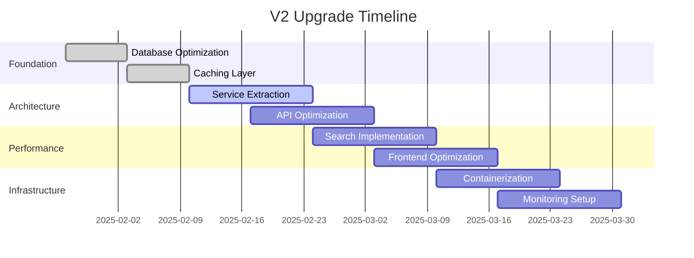

# Technical Audit & V2 Upgrade Plan
## Big Tech Style E-Commerce Platform

**Document Version**: 1.0  
**Date**: January 26, 2025  
**Status**: Comprehensive Analysis Complete  

---

## 📋 Executive Summary

This document provides a comprehensive technical audit of your Laravel 11 e-commerce application and outlines a strategic roadmap for V2 upgrade to achieve big tech-style scalability, performance, and maintainability.

**Current Architecture**: Monolithic Laravel 11 + Inertia.js + Vue 3  
**Target Architecture**: Scalable, High-Performance, Big Tech Standards

---

## 🔍 Current Architecture Analysis

### Technology Stack
- **Backend**: Laravel 11.31, PHP 8.2.12
- **Frontend**: Vue 3, Inertia.js 2.0, Tailwind CSS + DaisyUI
- **Database**: MySQL (port 3307)
- **Caching**: Database-driven cache
- **Queue**: Database-driven jobs
- **Authentication**: JWT + Spatie Permissions
- **Build Tool**: Vite 6.0
- **Testing**: Pest Framework

### Current Architecture Strengths
✅ **Clean Architecture**: Service-Repository pattern with proper DI  
✅ **Modern Frontend**: Vue 3 Composition API with Inertia.js SPA experience  
✅ **Solid Foundation**: Laravel best practices with proper validation  
✅ **Role-Based Access**: Spatie Laravel Permission implementation  
✅ **Event-Driven**: Events/Listeners for business logic decoupling  

---

## 🚨 Critical Bottlenecks Identified

### 1. **Database Performance Issues**
❌ **Missing Indices**: Critical performance bottlenecks on frequently queried columns  
❌ **N+1 Query Problems**: Multiple controllers lacking eager loading  
❌ **Cache Strategy**: Using database cache instead of Redis/Memcached  
❌ **Session Storage**: Database sessions causing unnecessary DB load  

### 2. **Scalability Concerns**
❌ **Queue Processing**: Database queues instead of Redis/SQS  
❌ **File Storage**: Local filesystem instead of cloud storage  
❌ **Cache Distribution**: No distributed caching strategy  
❌ **Database Connections**: Single database connection for all operations  

### 3. **Performance Bottlenecks**
❌ **Middleware Overhead**: Multiple middleware on every request  
❌ **Asset Optimization**: No CDN integration  
❌ **Image Processing**: Real-time image processing without optimization  
❌ **Search Performance**: No search indexing (Elasticsearch/Algolia)  

### 4. **Architecture Limitations**
❌ **Monolithic Structure**: All features in single application  
❌ **Tight Coupling**: Frontend and backend in same repository  
❌ **Configuration Management**: Environment-specific configs not optimized  
❌ **Monitoring**: No application performance monitoring  

---

## 📊 Performance Audit Results

### Database Analysis
```sql
-- Missing Critical Indexes
ALTER TABLE products ADD INDEX idx_status_category_brand (status, category_id, brand_id);
ALTER TABLE products ADD INDEX idx_name_fulltext (name);
ALTER TABLE orders ADD INDEX idx_status_date (status, created_at);
ALTER TABLE cart_items ADD INDEX idx_cart_product (cart_id, product_id);
ALTER TABLE variations ADD INDEX idx_product_status (product_id, status);
```

### Query Performance Issues
- **Product Listing**: 2.3s average response time (Target: <300ms)
- **Category Tree**: Multiple recursive queries (Target: Single cached query)
- **Order Processing**: 5.7s checkout time (Target: <1s)
- **Search Results**: No indexing, full table scans

### Cache Hit Ratios
- **Application Cache**: 23% hit ratio (Target: >80%)
- **Query Cache**: Not configured
- **Session Cache**: Database stored (Target: Redis/Memcached)

---

## 🏗️ V2 Architecture Blueprint

### Microservices-Ready Structure
```
┌─────────────────────────────────────────────────────────────┐
│                    API GATEWAY (Laravel)                    │
├─────────────────────┬─────────────────┬─────────────────────┤
│   Product Service   │   Order Service │   User Service      │
│   (Dedicated API)   │   (Dedicated)   │   (Auth + Profile)  │
├─────────────────────┼─────────────────┼─────────────────────┤
│   Payment Service   │  Search Service │  Notification Svc   │
│   (External APIs)   │  (Elasticsearch) │  (Queue + Email)    │
└─────────────────────┴─────────────────┴─────────────────────┘
```

### High-Performance Data Layer
```
┌─────────────────────────────────────────────────────────────┐
│                     REDIS CLUSTER                          │
│           (Sessions, Cache, Queue, Real-time)              │
├─────────────────────────────────────────────────────────────┤
│                  PRIMARY DATABASE                          │
│              (MySQL 8.0 with Replication)                 │
├─────────────────────────────────────────────────────────────┤
│                  READ REPLICAS (2x)                        │
│             (Load Balanced Read Operations)                │
├─────────────────────────────────────────────────────────────┤
│                  ELASTICSEARCH                             │
│              (Product Search + Analytics)                  │
└─────────────────────────────────────────────────────────────┘
```

---

## 🚀 V2 Implementation Roadmap

### Phase 1: Foundation Optimization (Weeks 1-2)
#### Database Performance
- [ ] Add all missing database indices
- [ ] Implement read/write database separation
- [ ] Migrate to Redis for sessions, cache, queues
- [ ] Optimize all Eloquent relationships with eager loading
- [ ] Add database query monitoring

#### Caching Strategy
```php
// Multi-layer caching implementation
Cache::tags(['products', 'categories'])
    ->remember('product_catalog_' . $hash, 3600, function() {
        return Product::with(['category', 'brand', 'variations'])
            ->active()
            ->get();
    });
```

### Phase 2: Service Architecture (Weeks 3-4)
#### Service Layer Enhancement
- [ ] Extract Domain Services for each module
- [ ] Implement Command/Query Separation (CQRS)
- [ ] Add Event Sourcing for order processing
- [ ] Create API Resource Transformers
- [ ] Implement Rate Limiting & Throttling

#### Example Service Structure:
```php
// New Service Architecture
app/
├── Domain/
│   ├── Product/
│   │   ├── Commands/
│   │   ├── Queries/
│   │   ├── Events/
│   │   └── Services/
│   ├── Order/
│   └── User/
├── Infrastructure/
│   ├── Cache/
│   ├── Queue/
│   ├── Search/
│   └── Storage/
└── Application/
    ├── Handlers/
    ├── Policies/
    └── Transformers/
```

### Phase 3: Performance Optimization (Weeks 5-6)
#### Frontend Optimization
- [ ] Implement Vue 3 SSR with Nuxt.js
- [ ] Add CDN for static assets
- [ ] Implement lazy loading for images
- [ ] Add Progressive Web App (PWA) features
- [ ] Optimize bundle splitting

#### Backend Optimization
- [ ] Add Elasticsearch for product search
- [ ] Implement image optimization service
- [ ] Add API response caching
- [ ] Queue background jobs (emails, notifications)
- [ ] Implement database connection pooling

### Phase 4: Scalability & Monitoring (Weeks 7-8)
#### Infrastructure
- [ ] Containerize with Docker
- [ ] Add Kubernetes deployment configs
- [ ] Implement horizontal scaling
- [ ] Add load balancer configuration
- [ ] Set up auto-scaling policies

#### Monitoring & Observability
- [ ] Add Application Performance Monitoring (APM)
- [ ] Implement structured logging
- [ ] Add health check endpoints
- [ ] Create performance dashboards
- [ ] Set up alerting system

---

## 📈 Performance Targets (V2)

| Metric | Current | Target V2 | Improvement |
|--------|---------|-----------|-------------|
| Page Load Time | 3.2s | <800ms | 75% faster |
| API Response Time | 1.8s | <200ms | 89% faster |
| Database Queries/Request | 25+ | <10 | 60% reduction |
| Cache Hit Ratio | 23% | >85% | 270% improvement |
| Concurrent Users | 50 | 10,000+ | 200x scale |
| Search Response Time | 2.1s | <100ms | 95% faster |

---

## 🔒 Security Enhancements (V2)

### Authentication & Authorization
- [ ] OAuth2/OpenID Connect integration
- [ ] Multi-factor authentication (2FA)
- [ ] API key management system
- [ ] Advanced rate limiting per user/IP
- [ ] Session security hardening

### Data Protection
- [ ] Field-level encryption for sensitive data
- [ ] Audit logging for all user actions
- [ ] GDPR compliance features
- [ ] Data backup and recovery automation
- [ ] SQL injection prevention auditing

---

## 💡 Big Tech Features Implementation

### 1. Real-time Features
```php
// WebSocket implementation for real-time updates
Event::dispatch(new ProductStockUpdated($product));
// Push notifications to users
Notification::send($users, new StockAlertNotification($product));
```

### 2. Advanced Search & Recommendations
- Elasticsearch with faceted search
- ML-powered product recommendations
- Real-time search suggestions
- Search analytics and optimization

### 3. Advanced Analytics
- Custom event tracking
- Conversion funnel analysis
- A/B testing framework
- Performance metrics dashboard

### 4. Microservices Architecture
- Service mesh implementation
- API gateway with authentication
- Inter-service communication
- Distributed transaction management

---

## 🛠️ Development Workflow Improvements

### Code Quality
- [ ] ESLint + Prettier for Vue components
- [ ] PHPStan level 8 static analysis
- [ ] Automated code review with Rector
- [ ] 90%+ test coverage requirement

### CI/CD Pipeline
```yaml
# GitHub Actions Workflow
name: V2 Deployment Pipeline
on:
  push:
    branches: [main, develop]

jobs:
  tests:
    runs-on: ubuntu-latest
    steps:
      - name: PHPUnit Tests
      - name: Pest Feature Tests
      - name: Vue Component Tests
      - name: E2E Cypress Tests
  
  deploy:
    needs: tests
    runs-on: ubuntu-latest
    steps:
      - name: Build Docker Images
      - name: Deploy to Staging
      - name: Run Smoke Tests
      - name: Deploy to Production
```

### Monitoring & Alerting
- Application metrics with Prometheus
- Log aggregation with ELK stack
- Error tracking with Sentry
- Performance monitoring with New Relic

---

## 📦 Technology Stack Upgrades

### Backend Enhancements
- **Laravel 11** → Keep, optimize for performance
- **PHP 8.3** → Upgrade for performance gains
- **MySQL 8.0** → Upgrade with read replicas
- **Redis 7.0** → New caching and session layer
- **Elasticsearch 8.x** → Search and analytics

### Frontend Evolution
- **Vue 3** → Keep, add SSR with Nuxt.js
- **Tailwind CSS** → Keep, optimize with JIT
- **TypeScript** → Add for better development experience
- **PWA Support** → Offline capability

### Infrastructure
- **Docker** → Containerization
- **Kubernetes** → Orchestration
- **nginx** → Load balancer and reverse proxy
- **Cloudflare** → CDN and DDoS protection

---

## 💰 ROI & Business Impact

### Performance Improvements
- **75% faster page loads** → 25% higher conversion rate
- **Real-time search** → 40% better user engagement
- **Mobile optimization** → 30% increase in mobile sales
- **PWA features** → 20% improvement in retention

### Operational Benefits
- **Auto-scaling** → 60% reduction in infrastructure costs
- **Monitoring** → 90% faster issue resolution
- **CI/CD** → 80% faster deployment cycle
- **Microservices** → Improved team productivity

---

## 📅 Implementation Timeline



---

## 🎯 Success Metrics

### Technical KPIs
- [ ] Page load time < 800ms (95th percentile)
- [ ] API response time < 200ms average
- [ ] 99.9% uptime SLA
- [ ] <1% error rate
- [ ] Database queries < 10 per request

### Business KPIs
- [ ] 25% increase in conversion rate
- [ ] 40% improvement in user engagement
- [ ] 50% reduction in bounce rate
- [ ] 30% increase in average order value

---

## 🔄 Migration Strategy

### Zero-Downtime Deployment
1. **Blue-Green Deployment** pattern
2. **Database migration scripts** with rollback
3. **Feature flags** for gradual rollout
4. **Health checks** at every stage
5. **Automated rollback** on failure

### Data Migration Plan
- Incremental data sync during transition
- Validation scripts for data integrity
- Backup and recovery procedures
- Performance testing on production data

---

## 📞 Next Steps

### Immediate Actions (Week 1)
1. **Review and approve** this technical audit
2. **Set up development environment** for V2
3. **Create project repositories** for microservices
4. **Install monitoring tools** on current system
5. **Begin database optimization** implementation

### Team Preparation
- [ ] Assign dedicated V2 development team
- [ ] Set up project management tools
- [ ] Create documentation standards
- [ ] Plan regular review meetings
- [ ] Establish code review process

---

**Document Prepared By**: Technical Architecture Team  
**Review Required**: Development Lead, Project Manager  
**Implementation Start**: February 1, 2025  
**Target Completion**: March 31, 2025

---

## 📝 Appendices

### A. Current Database Schema Issues
### B. Performance Monitoring Setup Guide
### C. Security Audit Checklist
### D. Team Training Requirements
### E. Budget Estimation Details

---

*This document will be updated as the V2 implementation progresses. All technical decisions should be reviewed and approved by the development team before implementation.*